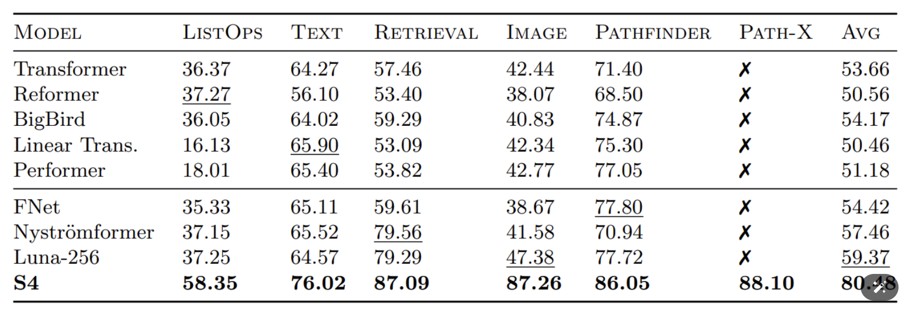
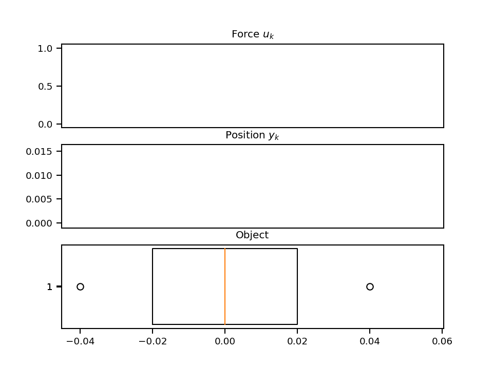
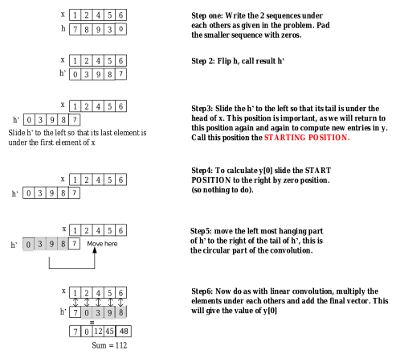
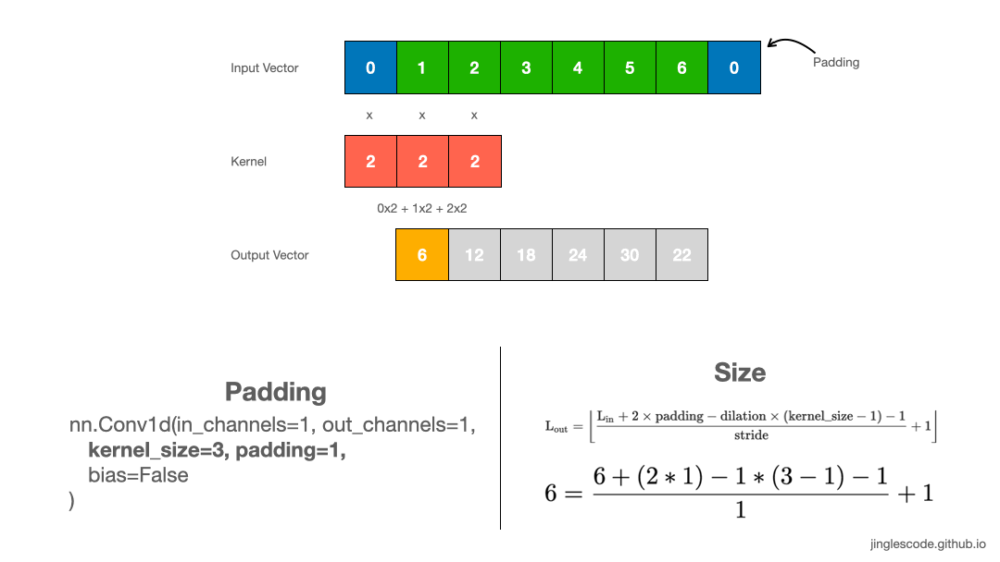

# The Annotated S4 - SSM

Author: Albert Gu, Karan Goel, and Christopher Ré.

Source: *Blog Post and [Library](https://github.com/srush/annotated-s4/) by [Sasha Rush](http://rush-nlp.com/) and [Sidd Karamcheti](https://www.siddkaramcheti.com/)*, v3

Paper: [Efficiently Modeling Long Sequences with Structured State Spaces](https://arxiv.org/abs/2111.00396)

结构化状态空间序列建模([Structured State Space for Sequence Modeling](https://arxiv.org/abs/2111.00396)  S4)架构是对视觉、语言和音频的超长序列建模任务的一种新方法，展示了捕获数万个步骤间依赖关系的能力。尤其令人印象深刻的是该模型在具有挑战性的长范围基准上的结果，展示了对高达 16,000+ 元素的序列进行推理的高准确性。



这篇论文是对 Transformers 的一种令人耳目一新的代替，采用了非常不同的方法来解决一个重要的问题领域。然而，我们的一些同事私下表示，理解该模型的直观感受上存在困难。这篇博客文章是朝着获得这种直观理解的目标迈出的第一步，将具体的代码实现与 S4 论文中的解释联系起来——与 [the annotated Transformer](https://nlp.seas.harvard.edu/2018/04/03/attention.html) 的风格非常相似。希望代码和通俗解释的结合能帮助您理解模型的细节。到博客结束时，您将拥有一个高效的 S4 工作版本，能够在训练时作为 CNN 操作，然后在测试时转换为高效的 RNN。


为了预览结果，您将能够直接从标准 GPU 上的音频波生成像素和声音的图像。

<div style="display: flex; justify-content: space-evenly;">   </div>

注意此项目使用 JAX 和 Flax NN 库。虽然我们个人主要使用 Torch，但 JAX 的函数性质非常适合 S4 的一些复杂性。我们大量使用 vmap、scan、它们的 NN 相关函数，以及最重要的 jax.jit 来编译快速高效的 S4 层。

```python
from functools import partial
import jax
import jax.numpy as np
from flax import linen as nn
from jax.nn.initializers import lecun_normal, normal
from jax.numpy.linalg import eigh, inv, matrix_power
from jax.scipy.signal import convolve
if __name__ == "__main__":
    # For this tutorial, construct a global JAX rng key
    # But we don't want it when importing as a library
    rng = jax.random.PRNGKey(1)
```

## 第 1 部分：状态空间模型

让我们开始吧！我们的目标是高效建模长序列。为此，我们将构建一个基于状态空间模型的新神经网络层。到本节结束时，我们将能够构建并运行带有该层的模型。然而，我们需要一些技术背景。让我们逐步了解论文的背景。

> 状态空间模型由以下简单方程定义。它将一维输入信号 $ u(t) $ 映射到 $ N $-维的潜在状态 $ x(t) $，然后投影到一维输出信号 $ y(t) $：
> 
> $$
> x'(t) = A x(t) + B u(t)
> $$
> $$
> y(t) = C x(t) + D u(t)
> $$
> 
> 我们的目标是将状态空间模型作为深度序列模型中的一个黑盒表示，其中 $ A, B, C, D $ 是通过梯度下降学习的参数。为了简化讨论，后续将省略参数 $ D $（或者等价地假设 $ D=0 $，因为项 $ D u $ 可以视为一种跳跃连接（skip connection），其计算也非常简单）。
> 
> 状态空间模型将输入 $ u(t) $ 映射到状态表示向量 $ x(t) $ 和输出 $ y(t) $。为简化起见，我们假设输入和输出是一维的，而状态表示是 $ N $-维的。第一个方程定义了 $ x(t) $ 随时间的变化


我们的状态空间模型将由三个矩阵定义 -A, B, C- 我们将学习。现在我们从一个随机的状态空间模型开始，以定义大小，

```python
def random_SSM(rng, N):
    a_r, b_r, c_r = jax.random.split(rng, 3)
    A = jax.random.uniform(a_r, (N, N))
    B = jax.random.uniform(b_r, (N, 1))
    C = jax.random.uniform(c_r, (1, N))
    return A, B, C
```

### 离散时间 SSM：递归表示

> 为了将状态空间模型应用于离散输入序列 $ (u_0, u_1, \dots) $ 而不是连续函数 $ u(t) $，需要通过步长 $ \Delta $ 对其进行离散化。步长 $ \Delta $ 表示输入的分辨率。从概念上讲，输入 $ u_k $ 可以看作是对隐式连续信号 $ u(t) $ 进行采样，其中：
>
> $$
> u_k = u(k\Delta)
> $$
>
> 为了离散化连续时间的状态空间模型 (SSM)，我们使用**双线性方法 (Bilinear Method)**，该方法将状态矩阵 $ A $ 转换为一个近似矩阵 $ \bar{A} $。离散化后的状态空间模型为：
>
> $$
> \bar{A} = (I - \frac{\Delta}{2} \cdot A)^{-1}(I + \frac{\Delta}{2} \cdot A)
> $$
> $$
> \bar{B} = (I - \frac{\Delta}{2} \cdot A)^{-1} \Delta B
> $$
> $$
> \bar{C} = C
> $$
>
> 其中：
> - $ \bar{A}, \bar{B}, \bar{C} $ 是离散化后的状态矩阵。
> - $ I $ 是单位矩阵。
>
> 双线性方法是一种基于梯形积分（Trapezoidal Integration）的数值方法，用于近似连续时间系统的行为。它的核心在于用离散时间的差分代替连续时间的导数：
> $$
> x'(t) \approx \frac{x_{k+1} - x_k}{\Delta}
> $$
>
> 将这一近似代入连续时间的状态方程 $ x'(t) = A x(t) + B u(t) $，得到：
> $$
> \frac{x_{k+1} - x_k}{\Delta} = A \cdot \frac{x_{k+1} + x_k}{2} + B \cdot u_k
> $$
>
> 这一步使用了梯形法来近似积分，其中 $ x_{k+1} $ 和 $ x_k $ 是当前和下一步的状态。
>
> 整理上述方程，得到：
> $$
> (I - \frac{\Delta}{2} \cdot A) \cdot x_{k+1} = (I + \frac{\Delta}{2} \cdot A) \cdot x_k + \Delta B \cdot u_k
> $$
>
> 为了表达离散化后的状态转移矩阵 $ \bar{A} $ 和输入矩阵 $ \bar{B} $，我们将方程改写为标准形式：
> $$
> x_{k+1} = \bar{A} \cdot x_k + \bar{B} \cdot u_k
> $$
>
> 通过矩阵运算，可以得到：
> $$
> \bar{A} = (I - \frac{\Delta}{2} \cdot A)^{-1} \cdot (I + \frac{\Delta}{2} \cdot A)
> $$
> $$
> \bar{B} = (I - \frac{\Delta}{2} \cdot A)^{-1} \cdot \Delta B
> $$
>
> 通过这两个公式，连续时间的状态空间模型被成功地离散化为离散时间形式，从而可以应用于离散输入序列。
>
> 通过这种离散化方法，连续时间的状态空间模型可以被转换为适用于离散输入序列的形式。

```python
def discretize(A, B, C, step):
    I = np.eye(A.shape[0])
    BL = inv(I - (step / 2.0) * A)
    Ab = BL @ (I + (step / 2.0) * A)
    Bb = (BL * step) @ B
    return Ab, Bb, C
```

> 通过离散化后，状态空间模型从一个函数到函数的映射 $ u(t) \to y(t) $ 转变为一个**序列到序列的映射** $ u_k \to y_k $。此外，状态方程现在变成了关于 $ x_k $ 的递推关系，这使得离散化后的状态空间模型可以像 RNN（循环神经网络）一样进行计算。
>
> 具体来说，$ x_k \in \mathbb{R}^N $ 可以被看作一个隐藏状态，其状态转移由矩阵 $ \bar{A} $ 控制：
>
> $$
> x_k = \bar{A} x_{k-1} + \bar{B} u_k
> $$
>
> 输出则由当前状态 $ x_k $ 和矩阵 $ \bar{C} $ 决定：
>
> $$
> y_k = \bar{C} x_k
> $$
>

正如论文所述，这个“step”函数确实在表面上看起来像RNN的函数。我们可以在JAX中通过scan来实现这个。

```python
def scan_SSM(Ab, Bb, Cb, u, x0):
    def step(x_k_1, u_k):
        x_k = Ab @ x_k_1 + Bb @ u_k
        y_k = Cb @ x_k
        return x_k, y_k

    return jax.lax.scan(step, x0, u)
 
# 这里使用了 jax.lax.scan 函数，这是 JAX 库中的一个高效扫描函数，
# 用于在多个时间步上迭代执行某个操作（类似于循环，但更高效，支持自动微分和并行化）。
```

将所有内容整合在一起，我们可以通过先离散化，然后逐步迭代来运行SSM，

```python
def run_SSM(A, B, C, u):
    """
    运行状态空间模型（SSM）。
    
    参数:
        A: 连续时间状态矩阵 (NxN)。
        B: 连续时间输入矩阵 (Nx1)。
        C: 输出矩阵 (1xN)。
        u: 输入信号 (L维向量)。
    
    返回:
        状态空间模型运行后的输出。
    """
    # 获取输入信号的长度 L
    L = u.shape[0]
    
    # 获取状态矩阵 A 的维度 N（假设 A 是方阵）
    N = A.shape[0]
    
    # 将连续时间状态空间模型 (A, B, C) 离散化
    # step 是离散化的步长，这里设置为 1.0 / L
    Ab, Bb, Cb = discretize(A, B, C, step=1.0 / L)
    
    # 运行状态空间模型的递推计算
    # 初始状态设置为零向量 np.zeros((N,))
    # scan_SSM 返回两个值，这里只取第二个值，即模型的输出
    return scan_SSM(Ab, Bb, Cb, u[:, np.newaxis], np.zeros((N,)))[1]
```

### 插曲：一个力学示例

为了获得更多直观理解并测试我们的状态空间模型 (SSM) 实现，我们来实现一个经典的力学示例。

在这个示例中，我们考虑一个质量块通过弹簧连接到墙壁的系统，其前向位置为 $ y(t) $。随着时间的推移，对该质量块施加了一个变化的力 $ u(t) $。该系统由以下参数描述：质量 $ m $、弹簧常数 $ k $、摩擦系数 $ b $。这些参数通过以下微分方程关联起来：

$$
m y''(t) = u(t) - b y'(t) - k y(t)
$$

要从微分方程 $$m y''(t) = u(t) - b y'(t) - k y(t)$$ 推导出矩阵形式的状态空间模型 (SSM)，我们需要将其转化为一阶微分方程组，具体步骤如下：

为了将二阶微分方程转化为一阶系统，我们引入两个状态变量：
- $x_1(t) = y(t)$ （即位置）
- $x_2(t) = y'(t)$ （即速度）

因此，我们有：
$$
x_1'(t) = x_2(t)
$$
$$
x_2'(t) = y''(t)
$$

将原始微分方程 $$m y''(t) = u(t) - b y'(t) - k y(t)$$ 替换为 $x_1$ 和 $x_2$：
$$
m x_2'(t) = u(t) - b x_2(t) - k x_1(t)
$$

两边同时除以 $m$，得到：
$$
x_2'(t) = -\frac{k}{m} x_1(t) - \frac{b}{m} x_2(t) + \frac{1}{m} u(t)
$$

将状态变量 $x_1(t)$ 和 $x_2(t)$ 的动态关系表示为矩阵形式：
$$
\begin{bmatrix}
x_1'(t) \\
x_2'(t)
\end{bmatrix}
=
\begin{bmatrix}
0 & 1 \\
-\frac{k}{m} & -\frac{b}{m}
\end{bmatrix}
\begin{bmatrix}
x_1(t) \\
x_2(t)
\end{bmatrix}
+
\begin{bmatrix}
0 \\
\frac{1}{m}
\end{bmatrix}
u(t)
$$

其中：
- 状态矩阵 $A = \begin{bmatrix} 0 & 1 \\ -\frac{k}{m} & -\frac{b}{m} \end{bmatrix}$
- 输入矩阵 $B = \begin{bmatrix} 0 \\ \frac{1}{m} \end{bmatrix}$

输出 $y(t)$ 是位置 $x_1(t)$，因此可以写成：
$$
y(t) = \begin{bmatrix} 1 & 0 \end{bmatrix} \begin{bmatrix} x_1(t) \\ x_2(t) \end{bmatrix}
$$

其中：
- 输出矩阵 $C = \begin{bmatrix} 1 & 0 \end{bmatrix}$

将以上结果总结为状态空间模型：
$$
\begin{aligned}
\text{状态方程:} \quad & \dot{x}(t) = A x(t) + B u(t) \\
\text{输出方程:} \quad & y(t) = C x(t)
\end{aligned}
$$

具体矩阵形式为：
$$
A = 
\begin{bmatrix}
0 & 1 \\
-\frac{k}{m} & -\frac{b}{m}
\end{bmatrix}, \quad
B = 
\begin{bmatrix}
0 \\
\frac{1}{m}
\end{bmatrix}, \quad
C = 
\begin{bmatrix}
1 & 0
\end{bmatrix}
$$

```python
def example_mass(k, b, m):
    A = np.array([[0, 1], [-k / m, -b / m]])
    B = np.array([[0], [1.0 / m]])
    C = np.array([[1.0, 0]])
    return A, B, C
```

通过观察矩阵 $ C $，我们可以确信隐藏状态的第一个维度是位置（因为它直接成为 $ y(t) $）。第二个维度是速度，因为它通过矩阵 $ B $ 受到输入 $ u(t) $ 的影响。而矩阵 $ A $ 则定义了这些量之间的关系。我们将设置 $ u $ 为 $ t $ 的连续函数。

```python
@partial(np.vectorize, signature="()->()")
def example_force(t):
    x = np.sin(10 * t)
    return x * (x > 0.5)
```

让我们通过我们的代码运行这个SSM。

```python
def example_ssm():
    # SSM
    ssm = example_mass(k=40, b=5, m=1)

    # L samples of u(t).
    L = 100
    step = 1.0 / L
    ks = np.arange(L)
    u = example_force(ks * step)

    # Approximation of y(t).
    y = run_SSM(*ssm, u)

    # Plotting ---
    import matplotlib.pyplot as plt
    import seaborn
    from celluloid import Camera

    seaborn.set_context("paper")
    fig, (ax1, ax2, ax3) = plt.subplots(3)
    camera = Camera(fig)
    ax1.set_title("Force $u_k$")
    ax2.set_title("Position $y_k$")
    ax3.set_title("Object")
    ax1.set_xticks([], [])
    ax2.set_xticks([], [])

    # Animate plot over time
    for k in range(0, L, 2):
        ax1.plot(ks[:k], u[:k], color="red")
        ax2.plot(ks[:k], y[:k], color="blue")
        ax3.boxplot(
            [[y[k, 0] - 0.04, y[k, 0], y[k, 0] + 0.04]],
            showcaps=False,
            whis=False,
            vert=False,
            widths=10,
        )
        camera.snap()
    anim = camera.animate()
    anim.save("images/line.gif", dpi=150, writer="imagemagick")
if False:
    example_ssm()
```



很棒！而这仅仅是一个状态空间模型 (SSM)，包含 2 个隐藏状态，运行了 100 步。最终的模型将会有数百个堆叠的 SSM，运行数千步。然而，首先——我们需要让这些模型在训练中变得实用。

### 训练 SSM：卷积表示

这一部分的结论是，我们可以通过展开将上面的“RNN”转换为“CNN”。让我们来推导一下。

> 由于循环状态空间模型 (SSM) 的顺序特性，在现代硬件上进行训练并不实用。然而，线性时不变 (LTI) SSM 与连续卷积之间存在一个众所周知的联系。因此，循环 SSM 实际上可以被表示为一个离散卷积。
>
> 为了简化，我们假设初始状态为 $x_{-1} = 0$。然后，显式展开的结果如下：
>
> $$
> x_0 = \bar{B} u_0
> $$
> $$
> x_1 = \bar{A} \bar{B} u_0 + \bar{B} u_1
> $$
> $$
> x_2 = \bar{A}^2 \bar{B} u_0 + \bar{A} \bar{B} u_1 + \bar{B} u_2
> $$
> $$
> \vdots
> $$
> $$
> y_0 = \bar{C} \bar{B} u_0
> $$
> $$
> y_1 = \bar{C} \bar{A} \bar{B} u_0 + \bar{C} \bar{B} u_1
> $$
> $$
> y_2 = \bar{C} \bar{A}^2 \bar{B} u_0 + \bar{C} \bar{A} \bar{B} u_1 + \bar{C} \bar{B} u_2
> $$
> $$
> \vdots
> $$
>
> 这些公式可以被向量化为一个卷积，其中卷积核有一个显式的公式：
>
> $$
> y_k = \bar{C} \bar{A}^k \bar{B} u_0 + \bar{C} \bar{A}^{k-1} \bar{B} u_1 + \cdots + \bar{C} \bar{A} \bar{B} u_{k-1} + \bar{C} \bar{B} u_k
> $$
> $$
> y = \bar{K} * u
> $$
>
> 其中卷积核 $\bar{K} \in \mathbb{R}^L$ 表示为：
> $$
> \bar{K} = (\bar{C} \bar{B}, \bar{C} \bar{A} \bar{B}, \ldots, \bar{C} \bar{A}^{L-1} \bar{B})
> $$
>
> 我们称 $\bar{K}$ 为 SSM 的卷积核。

注意这是一个巨大的卷积核。它的大小与整个序列相同！

```python
def K_conv(Ab, Bb, Cb, L):
    return np.array(
        [(Cb @ matrix_power(Ab, l) @ Bb).reshape() for l in range(L)]
    )
```

警告：此实现是简单且不稳定的。实际上，它无法在超过非常小的长度的情况下工作。然而，我们将在第2部分用S4替换它，因此现在我们只是把它保留作为占位符。

我们可以通过标准的直接卷积，或者使用快速傅里叶变换 (FFT) 的高效算法来应用此滤波器并计算结果。离散卷积定理——用于两个序列的循环卷积——允许我们通过以下步骤高效地计算卷积的输出：

1. 首先计算输入序列的 FFT；
2. 然后将其与卷积核的 FFT 相乘；
3. 最后应用逆 FFT 得到结果。

在我们的情况下，为了将该定理应用于非循环卷积，我们需要对输入序列进行零填充（zero-padding），以避免循环效应，并在计算完成后去掉输出序列中的填充值。

> - 循环卷积：
>
>     
>
> - 非循环卷积
>
>     

随着序列长度的增加，这种基于 FFT 的方法相比直接卷积将变得更加高效。

```python
def causal_convolution(u, K, nofft=False):
    if nofft:
        return convolve(u, K, mode="full")[: u.shape[0]]
    else:
        assert K.shape[0] == u.shape[0]
        ud = np.fft.rfft(np.pad(u, (0, K.shape[0])))
        Kd = np.fft.rfft(np.pad(K, (0, u.shape[0])))
        out = ud * Kd
        return np.fft.irfft(out)[: u.shape[0]]
```

CNN方法和RNN方法得到（大致上）相同的结果，

```python
def test_cnn_is_rnn(N=4, L=16, step=1.0 / 16):
    ssm = random_SSM(rng, N)
    u = jax.random.uniform(rng, (L,))
    jax.random.split(rng, 3)
    # RNN
    rec = run_SSM(*ssm, u)

    # CNN
    ssmb = discretize(*ssm, step=step)
    conv = causal_convolution(u, K_conv(*ssmb, L))

    # Check
    assert np.allclose(rec.ravel(), conv.ravel())
```

### SSM 神经网络

我们现在已经具备了构建一个基本 SSM（状态空间模型）神经网络层所需的所有工具。如上所述，离散 SSM 定义了一个从 $$R^L → R^L$$ 的映射，即一个一维序列的映射。我们假设需要学习以下参数：

- **B** 和 **C**：输入和输出的权重矩阵，
- **Δ**：步长参数，
- **D**：一个标量参数。

在此过程中，HiPPO 矩阵被用作状态转移矩阵 **A**。我们在对数空间中学习步长参数 **Δ**。

```python
def log_step_initializer(dt_min=0.001, dt_max=0.1):
    def init(key, shape):
        return jax.random.uniform(key, shape) * (
            np.log(dt_max) - np.log(dt_min)
        ) + np.log(dt_min)

    return init
```

对于 SSM 层，大部分工作集中在构建滤波器上。实际调用网络时，只是执行我们前面提到的（巨大的）卷积操作。

**针对 Torch 用户的说明**：在 Flax 中，每次更新参数时都会调用 `setup` 方法。这与 Torch 中的参数化机制类似。

如上所述，这个相同的层既可以用作 RNN，也可以用作 CNN。参数 `decode` 决定使用哪种路径。在 RNN 的情况下，我们会在每次调用时将上一次的状态缓存到 Flax 的变量集合 `cache` 中。

```python
class SSMLayer(nn.Module):
    N: int
    l_max: int
    decode: bool = False

    def setup(self):
        # SSM parameters
        self.A = self.param("A", lecun_normal(), (self.N, self.N))
        self.B = self.param("B", lecun_normal(), (self.N, 1))
        self.C = self.param("C", lecun_normal(), (1, self.N))
        self.D = self.param("D", nn.initializers.ones, (1,))

        # Step parameter
        self.log_step = self.param("log_step", log_step_initializer(), (1,))

        step = np.exp(self.log_step)
        self.ssm = discretize(self.A, self.B, self.C, step=step)
        self.K = K_conv(*self.ssm, self.l_max)

        # RNN cache for long sequences
        self.x_k_1 = self.variable("cache", "cache_x_k", np.zeros, (self.N,))

    def __call__(self, u):
        if not self.decode:
            # CNN Mode
            return causal_convolution(u, self.K) + self.D * u
        else:
            # RNN Mode
            x_k, y_s = scan_SSM(*self.ssm, u[:, np.newaxis], self.x_k_1.value)
            if self.is_mutable_collection("cache"):
                self.x_k_1.value = x_k
            return y_s.reshape(-1).real + self.D * u
```

由于我们的 SSM 是对标量进行操作的，因此我们创建了 **H** 个不同的、堆叠的副本（也就是 **H** 个不同的 SSM！），每个副本都有不同的参数。在这里，我们使用了 Flax 的 `vmap` 方法来轻松定义这些副本。

```python
def cloneLayer(layer):
    return nn.vmap(
        layer,
        in_axes=1,
        out_axes=1,
        variable_axes={"params": 1, "cache": 1, "prime": 1},
        split_rngs={"params": True},
    )
SSMLayer = cloneLayer(SSMLayer)
```

此 SSM 层可以被放入一个标准的 NN 中。在这里我们添加一个块，将对 SSM 的调用与 dropout 和线性投影配对。

```python
class SequenceBlock(nn.Module):
    layer_cls: nn.Module
    layer: dict  # Hyperparameters of inner layer
    dropout: float
    d_model: int
    prenorm: bool = True
    glu: bool = True
    training: bool = True
    decode: bool = False

    def setup(self):
        self.seq = self.layer_cls(**self.layer, decode=self.decode)
        self.norm = nn.LayerNorm()
        self.out = nn.Dense(self.d_model)
        if self.glu:
            self.out2 = nn.Dense(self.d_model)
        self.drop = nn.Dropout(
            self.dropout,
            broadcast_dims=[0],
            deterministic=not self.training,
        )

    def __call__(self, x):
        skip = x
        if self.prenorm:
            x = self.norm(x)
        x = self.seq(x)
        x = self.drop(nn.gelu(x))
        if self.glu:
            x = self.out(x) * jax.nn.sigmoid(self.out2(x))
        else:
            x = self.out(x)
        x = skip + self.drop(x)
        if not self.prenorm:
            x = self.norm(x)
        return x
```

然后我们可以将一堆这些块叠加在一起，以生成一堆SSM层。这可以用于分类或生成，以标准方式作为Transformer使用。

```python
class Embedding(nn.Embed):
    num_embeddings: int
    features: int

    @nn.compact
    def __call__(self, x):
        y = nn.Embed(self.num_embeddings, self.features)(x[..., 0])
        return np.where(x > 0, y, 0.0)
class StackedModel(nn.Module):
    layer_cls: nn.Module
    layer: dict  # Extra arguments to pass into layer constructor
    d_output: int
    d_model: int
    n_layers: int
    prenorm: bool = True
    dropout: float = 0.0
    embedding: bool = False  # Use nn.Embed instead of nn.Dense encoder
    classification: bool = False
    training: bool = True
    decode: bool = False  # Probably should be moved into layer_args

    def setup(self):
        if self.embedding:
            self.encoder = Embedding(self.d_output, self.d_model)
        else:
            self.encoder = nn.Dense(self.d_model)
        self.decoder = nn.Dense(self.d_output)
        self.layers = [
            SequenceBlock(
                layer_cls=self.layer_cls,
                layer=self.layer,
                prenorm=self.prenorm,
                d_model=self.d_model,
                dropout=self.dropout,
                training=self.training,
                decode=self.decode,
            )
            for _ in range(self.n_layers)
        ]

    def __call__(self, x):
        if not self.classification:
            if not self.embedding:
                x = x / 255.0  # Normalize
            if not self.decode:
                x = np.pad(x[:-1], [(1, 0), (0, 0)])
        x = self.encoder(x)
        for layer in self.layers:
            x = layer(x)
        if self.classification:
            x = np.mean(x, axis=0)
        x = self.decoder(x)
        return nn.log_softmax(x, axis=-1)
```

在 Flax 中，我们通过提升（lifted transformation）操作添加批量维度（batch dimension）。我们需要通过多个变量集合（variable collections）来处理 RNN 和参数缓存（稍后会具体描述）。

```python
BatchStackedModel = nn.vmap(
    StackedModel,
    in_axes=0,
    out_axes=0,
    variable_axes={"params": None, "dropout": None, "cache": 0, "prime": None},
    split_rngs={"params": False, "dropout": True},
)
```

> 注意：
>
> - 参数 `A`、`B`、`C`、`D` 和 `log_step` 是模型的全局参数，它们在整个批量的所有样本中是共享的。这些参数决定了模型的核心行为（状态转移、输入输出映射等），不依赖于具体的输入样本。
>
> - `cache` 是用于存储状态的变量，每个样本的状态是独立的。在批量处理中，每个样本的状态可能不同，因此需要为每个样本维护独立的缓存。
>
> - 例如：
>
>     ```
>     cache_x_k = [
>         [x1_1, x1_2, x1_3, x1_4],  # 第一个样本的状态
>         [x2_1, x2_2, x2_3, x2_4],  # 第二个样本的状态
>         [x3_1, x3_2, x3_3, x3_4],  # 第三个样本的状态
>     ]  # 形状 (Batch, 4)
>     ```
>
>     

总体而言，这定义了一个形状为 `(batch size, sequence length, hidden dimension)` 的序列到序列映射，正如 Transformer、RNN 和 CNN 等相关序列模型的外部接口一样。

虽然我们现在已经有了主要的模型，但 SSM 存在两个核心问题。首先，随机初始化的 SSM 实际上表现并不好。此外，像我们目前这样直接计算它的方式非常慢且内存效率低下。接下来，我们将通过定义一种用于长程依赖的特殊初始化来完成对 S4 模型化方面的讨论，然后研究如何更快地计算这个 SSM 层（详见第二部分！）

在开始之前，可以先运行训练的完整代码在 [train.py](../train.py)加深理解。


> 第 2 部分：实现 S4： [The Annotated S4 - Implementing S4](./The-Annotated-S4-CN-Part2.md)